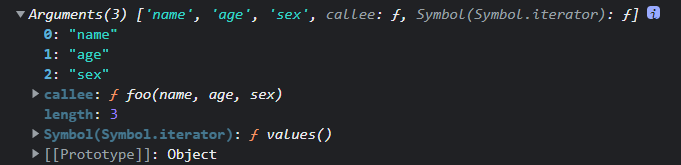

# 类数组对象

> 拥有一个 length 属性和若干索引属性的对象

例子：

```js
var array = ['name', 'age', 'sex'];

var arrayLike = {
    0: 'name',
    1: 'age',
    2: 'sex',
    length: 3
}
```

数组和类数组对象对比：

读写：

```js
console.log(array[0]); // name
console.log(arrayLike[0]); // name

array[0] = 'new name';
arrayLike[0] = 'new name';
```

长度：

```js
console.log(array.length); // 3
console.log(arrayLike.length); // 3
```

遍历：

```js
for(var i = 0, len = array.length; i < len; i++) {
   ……
}
for(var i = 0, len = arrayLike.length; i < len; i++) {
    ……
}
```

这些一样，但是不能调用Array.prototype上的一些方法比如push, pop, ....

## 类数组对象调用数组的方法

如果类数组就是想用数组的方法怎么办呢？

既然无法直接调用，我们可以用 Function.call 间接调用：

```js
var arrayLike = {0: 'name', 1: 'age', 2: 'sex', length: 3 }

Array.prototype.join.call(arrayLike, '&'); // name&age&sex

Array.prototype.slice.call(arrayLike, 0); // ["name", "age", "sex"] 
// slice可以做到类数组转数组

Array.prototype.map.call(arrayLike, function(item){
    return item.toUpperCase();
}); 
// ["NAME", "AGE", "SEX"]
```

# 类数组转数组

除了上述提到的，还有：

```js
var arrayLike = {0: 'name', 1: 'age', 2: 'sex', length: 3 }
// 1. slice
Array.prototype.slice.call(arrayLike); // ["name", "age", "sex"] 
// 2. splice
Array.prototype.splice.call(arrayLike, 0); // ["name", "age", "sex"] 
// 3. ES6 Array.from
Array.from(arrayLike); // ["name", "age", "sex"] 
// 4. concat和apply
Array.prototype.concat.apply([], arrayLike)
```


# Arguments对象

Arguments 对象只定义在函数体中，包括了函数的参数和其他属性。在函数体中，arguments 指代该函数的 Arguments 对象。

例：

```js
function foo(name, age, sex) {
    console.log(arguments);
}

foo('name', 'age', 'sex')
```

打印结果:



## lenth属性

Arguments对象的length属性，表示**实参**的长度

```js
function foo(b, c, d){
    console.log("实参的长度为：" + arguments.length)
}

console.log("形参的长度为：" + foo.length)

foo(1)

// 形参的长度为：3
// 实参的长度为：1
```


## callee属性

Arguments 对象的 callee 属性，通过它可以调用函数自身。

讲个闭包经典面试题使用 callee 的解决方法：

```js
var data = [];

for (var i = 0; i < 3; i++) {
    (data[i] = function () {
       console.log(arguments.callee.i) 	// 这里arguments.callee相当于data[i]这个函数
    }).i = i;	// 此处相当于把data[i]这个函数添加了一个i（这个i为字符串）属性，属性值为i（这个i为变量i，是数字）
}

data[0]();
data[1]();
data[2]();

// 0
// 1
// 2
```


## 几个注意点

### arguments 和对应参数的绑定

```js
function foo(name, age, sex, hobbit) {

    console.log(name, arguments[0]); // name name

    // 改变形参
    name = 'new name';

    console.log(name, arguments[0]); // new name new name

    // 改变arguments
    arguments[1] = 'new age';

    console.log(age, arguments[1]); // new age new age

    // 测试未传入的是否会绑定
    console.log(sex); // undefined

    sex = 'new sex';

    console.log(sex, arguments[2]); // new sex undefined

    arguments[3] = 'new hobbit';

    console.log(hobbit, arguments[3]); // undefined new hobbit

}

foo('name', 'age')
```

**传入的参数，实参和 arguments 的值会共享，当没有传入时，实参与 arguments 值不会共享**

**除此之外，以上是在非严格模式下，如果是在严格模式下，实参和 arguments 是不会共享的。**


### 传递参数

```js
// 使用 apply 将 foo 的参数传递给 bar
function foo() {
    bar.apply(this, arguments);
}
function bar(a, b, c) {
   console.log(a, b, c);
}

foo(1, 2, 3)  // 1, 2, 3
```


### 强大的ES6

使用ES6的 ... 运算符，我们可以轻松转成数组

```js
function func(...arguments) {
    console.log(arguments); // [1, 2, 3]
}

func(1, 2, 3);
```
