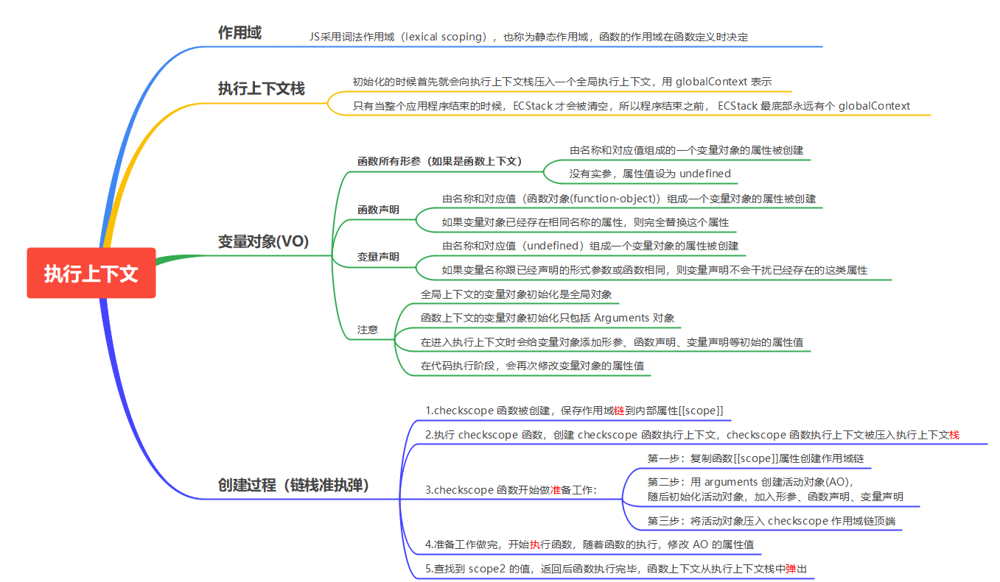

# 深入理解词法作用域和动态作用域

### 作用域（Scope）

* 指程序源代码中定义变量的区域
* 决定了如何查找变量，确定当前执行代码对变量访问的权限

* JS采用**词法作用域**（lexical scoping），也称为**静态作用域**，函数的作用域在**函数定义**的时候就决定了。

### 静态作用域和动态作用域

例子：

```javascript
var value = 1;

function foo() {
    console.log(value);
}

function bar() {
    var value = 2;
    foo();
}

bar();

// 结果是 ???
```

结果是1，分析执行过程：

1. 执行 foo 函数，
2. 从 foo 函数内部查找是否有局部变量 value，
3. 没有value，就根据**定义函数的位置**，查找上面一层的代码，也就是 value 等于 1，所以结果会打印 1。

假设JavaScript采用动态作用域，分析执行过程：

1. 执行 foo 函数；
2. 从 foo 函数内部查找是否有局部变量 value；
3. 没有，从**调用函数的作用域**，也就是 bar 函数内部查找 value 变量，所以结果会打印 2。

前面我们已经说了，JavaScript采用的是静态作用域，所以这个例子的结果是 1。

### 思考

```javascript
var scope = "global scope";
function checkscope(){
    var scope = "local scope";
    function f(){
        return scope;
    }
    return f();
}
checkscope();
```

```javascript
var scope = "global scope";
function checkscope(){
    var scope = "local scope";
    function f(){
        return scope;
    }
    return f;
}
checkscope()();
```

两段代码的输出结果：local scope。

原因：JavaScript采用的是**词法作用域**，**函数的作用域基于函数创建的位置**。

*JavaScript 函数的执行用到了作用域链，这个作用域链是在**函数定义**的时候创建的。嵌套**的函数 f() 定义在这个作用域链里，其中的变量 scope 一定是局部变量，不管何时何地执行函数 f()，这种绑定在执行 f() 时依然有效。*


# 深入理解执行上下文栈

看输出！

```javascript
var foo = function () {
    console.log('foo1');
}
foo();  // foo1

var foo = function () {
    console.log('foo2');
}
foo(); // foo2
```

```javascript

function foo() {
    console.log('foo1');
}
foo();  // foo2

function foo() {
    console.log('foo2');
}
foo(); // foo2

```

JavaScript 引擎并非一行一行地分析和执行程序，而是一段一段地分析执行。当执行一段代码的时候，会进行一个“准备工作”，比如第一个例子中的变量提升，和第二个例子中的函数提升。

### 执行上下文栈

通过数组来模拟执行上下文栈的行为：

```javascript
ECStack = [];
```

1. 当 JavaScript 开始要解释执行代码的时候，最先遇到的就是全局代码；
2. 初始化的时候首先就会向执行上下文栈压入一个全局执行上下文，用 globalContext 表示；
3. 只有当整个应用程序结束的时候，ECStack 才会被清空，所以程序结束之前， ECStack 最底部永远有个 globalContext。

```javascript
ECStack = [
    globalContext
];
```

当执行以下代码时：

```javascript
function fun3() {
    console.log('fun3')
    // 4.fun3执行完毕，弹出fun3的执行上下文
}

function fun2() {
    fun3();	// 3.创建fun3的执行上下文并压入执行上下文栈
    // 5.fun2执行完毕，弹出fun3的执行上下文
}

function fun1() {
    fun2();	// 2.创建fun2的执行上下文并压入执行上下文栈
    // 6.fun1执行完毕，弹出fun3的执行上下文
}

fun1();		// 1.创建fun1的执行上下文并压入执行上下文栈
```

发生了如下过程：

```js
// 伪代码

// fun1()
ECStack.push(<fun1> functionContext);

// fun1中竟然调用了fun2，还要创建fun2的执行上下文
ECStack.push(<fun2> functionContext);

// 擦，fun2还调用了fun3！
ECStack.push(<fun3> functionContext);

// fun3执行完毕
ECStack.pop();

// fun2执行完毕
ECStack.pop();

// fun1执行完毕
ECStack.pop();

// javascript接着执行下面的代码，但是ECStack底层永远有个globalContext
```

### 思考解答

```javascript
var scope = "global scope";
function checkscope(){
    var scope = "local scope";
    function f(){
        return scope;
    }
    return f();	//2.创建f的上下文
}
checkscope();	//1.创建checkscope的上下文
```

```javascript
var scope = "global scope";
function checkscope(){
    var scope = "local scope";
    function f(){
        return scope;
    }
    return f;
}
checkscope()();	  // 执行到第一个括号后，已经创建并弹出了checkscope的上下文，第二个括号执行时再创建f的上下文
```

两段代码的输出都为local scope，但执行上下文栈的变化不同

第一段：

```
ECStack.push(<checkscope> functionContext);
ECStack.push(<f> functionContext);
ECStack.pop();
ECStack.pop();
```

第二段：

```
ECStack.push(<checkscope> functionContext);
ECStack.pop();
ECStack.push(<f> functionContext);
ECStack.pop();
```

### 执行上下文与作用域的区别

作用域：函数定义时就确定，不会改变

执行上下文：函数执行之前创建（执行上下文的this指向是执行时才确定），随时可能改变

一个作用域下可能包含若干个上下文环境，同一作用域下，不同的调用会产生不同的执行上下文环境，继而产生不同变量的值


# 深入理解变量对象

对于每个执行上下文都有三个属性：

1. 变量对象
2. 作用域链
3. this

### 变量对象

指的是和执行上下文相关的数据作用域，存储了在上下文中定义的**变量**和**函数声明**，不同执行上下文的变量对象不同。

##### 全局上下文中的变量对象：全局对象（Window对象）

全局对象：W3School解释

> *全局对象是预定义的对象，作为 JavaScript 的全局函数和全局属性的占位符。通过使用全局对象，可以访问所有其他所有预定义的对象、函数和属性。*

> *在顶层 JavaScript 代码中，可以用关键字 this 引用全局对象。因为全局对象是作用域链的头，这意味着所有非限定性的变量和函数名都会作为该对象的属性来查询。*

> *例如，当JavaScript 代码引用 parseInt() 函数时，它引用的是全局对象的 parseInt 属性。全局对象是作用域链的头，还意味着在顶层 JavaScript 代码中声明的所有变量都将成为全局对象的属性。*

全局上下文中的变量对象就是全局对象


##### 函数上下文中的变量对象：活动对象（activation object, AO）

活动对象和变量对象其实是一个东西，只是变量对象是规范上的或者说是引擎实现上的，不可在 JavaScript 环境中访问，只有到当进入一个执行上下文中，这个执行上下文的变量对象才会被激活，所以才叫 activation object 呐，而只有被激活的变量对象，也就是活动对象上的各种属性才能被访问。

活动对象是在**进入函数上下文时刻被创建**的，它通过函数的 arguments 属性初始化。arguments 属性值是 Arguments 对象，**函数上下文的变量对象初始化只包括 Arguments 对象**。


### 执行过程

1. 进入执行上下文
2. 执行代码

##### 进入执行上下文

变量对象包括：

1. 函数所有形参（如果是函数上下文）
2. 函数声明：如果变量对象已经存在相同名称的属性，则**完全替换**这个属性
3. 变量声明：如果变量名称跟已经声明的形式参数或函数相同，则变量声明**不会干扰**已经存在的这类属性

例子：

```javascript
function foo(a) {
  var b = 2;
  function c() {}
  var d = function() {};

  b = 3;

}

foo(1);
```

AO为：

```javascript
AO = {
    arguments: {
        0: 1,
        length: 1
    },
    a: 1,				//形参，由名称和对应值组成的一个变量对象的属性被创建
    b: undefined,			//变量声明，由名称和对应值（undefined）组成一个变量对象的属性被创建；
    c: reference to function c(){},	//函数声明，由名称和对应值（函数对象(function-object)）组成一个变量对象的属性被创建
    d: undefined			//变量声明，由名称和对应值（undefined）组成一个变量对象的属性被创建；
}
```

##### 代码执行

此时AO变为

```javascript
AO = {
    arguments: {
        0: 1,
        length: 1
    },
    a: 1,
    b: 3,
    c: reference to function c(){},
    d: reference to FunctionExpression "d"
}
```

##### 思考题一

```javascript
function foo() {
    console.log(a);
    a = 1;
}

foo(); // ???

function bar() {
    a = 1;
    console.log(a);
}
bar(); // ???
```

第一行报错，第二行输出1

这是因为函数中的 "a" 并没有通过 var 关键字声明，所有**不会被存放在 AO 中**。

第一段执行 console 的时候， AO 的值是：

```javascript
AO = {
    arguments: {
        length: 0
    }
}
```

没有 a 的值，然后就会到全局去找，全局也没有，所以会报错。

当第二段执行 console 的时候，全局对象已经被赋予了 a 属性，这时候就可以从全局找到 a 的值，所以会打印 1。

##### 思考题二

```javascript
console.log(foo);

function foo(){
    console.log("foo");
}

var foo = 1;
```

输出函数

在进入执行上下文时，**首先会处理函数声明**，**其次会处理变量声明**，如果变量名称跟已经声明的形式参数或函数相同，则用var的变量声明不会干扰已经存在的这类属性。


# 深入理解作用域链

##### 查找变量的过程：

* 从当前上下文的变量对象中查找；
* 如果没有找到，就会从**父级(词法层面上的父级)执行上下文**的变量对象中查找，依次往上查找
* 直到找到全局上下文的变量对象，也就是全局对象。
* 这样由多个执行上下文的变量对象构成的链表就叫做作用域链。

##### 模拟作用域链的查找和变化：

* 函数的作用域在函数定义时被确定
* 函数内部有个[[scope]]属性，当函数创建时，会保存所有父变量对象到[[scope]]中
* [[scope]]就是所有父变量对象的层级链
* 注意：[[scope]]并不代表完整的作用域链！

作用域链创建过程：

```javascript
function foo() {
    function bar() {
        ...
    }
}
```

函数创建时，各自的[[scope]]为

```javascript
foo.[[scope]] = [
  globalContext.VO	//foo的父变量对象VO就是全局变量
];

bar.[[scope]] = [
    fooContext.AO,	//bar的父变量对象是foo上下文里的AO（活动对象）
    globalContext.VO	//bar也包括foo的父变量对象，即全局变量
];
```

函数激活时，进入函数上下文，创建了AO/VO后，就会将活动对象添加到作用域链的前端

此时将执行上下文的作用域链命名为Scope：

```javascript
Scope = [AO].concat([[Scope]]);
```

至此，作用域链创建完毕


##### 例子

```javascript
var scope = "全局作用域";
function checkscope(){
    var scope2 = '局部作用域';
    return scope2;
}
checkscope();
```

执行过程：

1.checkscope 函数被创建，保存作用域链到内部属性[[scope]]

```javascript
checkscope.[[scope]] = [
    globalContext.VO	//checkscope的父变量对象就是全局变量对象globalContext.VO
];
```

2.执行 checkscope 函数，创建 checkscope 函数执行上下文，checkscope 函数执行上下文被压入执行上下文栈

```javascript
ECStack = [
    checkscopeContext,	//checkscope函数的上下文，创建后被压入执行上下文栈
    globalContext	//全局上下文，初始化的时候首先就会向执行上下文栈压入一个全局执行上下文
];
```

3.checkscope 函数并不立刻执行，开始做准备工作，第一步：复制函数[[scope]]属性创建作用域链

```javascript
checkscopeContext = {
    Scope: checkscope.[[scope]],
}
```

4.第二步：用 arguments 创建活动对象，随后初始化活动对象，加入形参、函数声明、变量声明

```javascript
checkscopeContext = {
    AO: {
        arguments: {
            length: 0
        },
        scope2: undefined
    }，
    Scope: checkscope.[[scope]],
}
```

5.第三步：将活动对象压入 checkscope 作用域链顶端

```javascript
checkscopeContext = {
    AO: {
        arguments: {
            length: 0
        },
        scope2: undefined
    },
    Scope: [AO, [[Scope]]]
}
```

6.准备工作做完，开始执行函数，随着函数的执行，修改 AO 的属性值

```javascript
checkscopeContext = {
    AO: {
        arguments: {
            length: 0
        },
        scope2: 'local scope'
    },
    Scope: [AO, [[Scope]]]
}
```

7.查找到 scope2 的值，返回后函数执行完毕，函数上下文从执行上下文栈中弹出

```javascript
ECStack = [
    globalContext
];
```


# 总结


