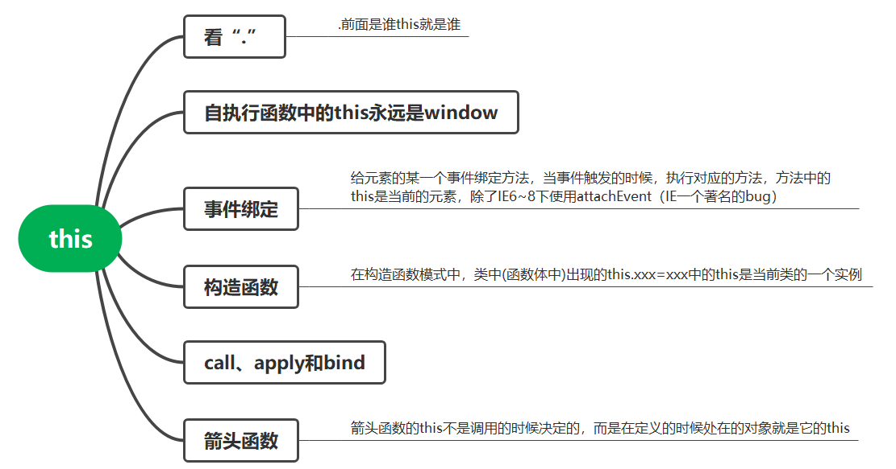

# 这回一定要把this搞懂了！

### this的五种情况

1.函数执行时看函数名前面是否有“.”，有的话，“.”前面是谁this就是谁，没有的话this就是window

```javascript
function fn() {
  console.log(this)
}
var obj = { fn: fn }
fn() //this->window
obj.fn() //this->obj
function sum() {
  fn() //this->window
}
sum()
var oo = {
  sum: function () {
    console.log(this) //this->oo
    fn() //this->window
  },
}
oo.sum()
```

2.自执行函数中的this永远指向window

```javascript
  (function(){ //this->window })();
  ~function(){ //this->window }();
```

3.给元素的某一个事件绑定方法，当事件触发时，执行对应的方法，方法中的this是当前的元素（除了IE6~8的attachEvent）

```javascript
  oDiv.onclick = function(){
     //this->oDiv
  };
```

```javascript
  oDiv.addEventListener("click",function(){
     //this->oDiv
  },false);
```

```javascript
function fn(){
  console.log(this);
}
document.getElementById("div1").onclick=fn;//fn中的this就是#divl
document.getElementById("div1").onclick=function(){
console.log(this);//this->#div1
fn();//this->window
}；
```

IE6~8:

```javascript
  oDiv.attachEvent("click",function(){
       //this->window
  });
```

4.构造函数模式中，类（函数体）中出现的this.xxx = xxx中this是当前类的一个实例

```javascript
function CreateJsPerson(name, age) {
  //浏览器默认创建的对象就是我们的实例p1->this
  this.name = name //->p1.name=name
  this.age = age
  this.writeJs = function () {
    console.log('my name is' + this.name + ',i can write Js')
  }
  //浏览器再把创建的实例默认的进行返回
}
var p1 = new CreateJsPerson('尹华芝', 48)
```

注意： **类中某一个属性值(方法)，方法中的this需要看方法执行的时候，前面是否有".",才能知道this是谁** 。大家不妨看下接下来的这个例子，就可明白是啥意思。

```javascript
function Fn() {
  this.x = 100 //this->f1
  this.getX = function () {
    console.log(this.x) //this->需要看getX执行的时候才知道
  }
}
var f1 = new Fn()
f1.getX() //->方法中的this是f1，所以f1.x=100
var ss = f1.getX
ss() //->方法中的this是window ->undefined
```

5.call、apply、bind

* call

  ```javascript
  //在非严格模式下
  var obj = { name: '笑笑 ' }
  function fn(num1, num2) {
    console.log(num1 + num2)
    console.log(this)
  }
  fn.call(100, 200) //this->100 num1=200 num2=undefined
  fn.call(obj, 100, 200) //this->obj num1=100 num2=200
  fn.call() //this->window
  fn.call(null) //this->window
  fn.call(undefined) //this->window

  //严格模式下
  fn.call() //在严格模式下this->undefined
  fn.call(null) // 在严格模式 下this->null
  fn.call(undefined) //在严格模式下this->undefined
  ```
* apply：和call方法的作用是一模一样的，都是用来改变方法的this关键字并且把方法执行，而且在严格模式下和非严格模式下对于第一个参数是null/undefined这种情况的规律也是一样的。区别是call在给fn传递参数的时候，是一个个的传递值的，而apply不是一个个传，而是把要给fn传递的参数值统一的放在一个数组中进行操作。但是也相当子一个个的给fn的形参赋值。**总结一句话:call第二个参数开始接受一个参数列表,apply第二个参数开始接受一个参数数组**

  ```javascript
  fn.call(obj,100,200);
  fn.apply(obj,[100,200]);
  ```
* bind：这个方法在IE6～8下不兼容，和call/apply类似都是用来改变this关键字的，但是和这两者有明显区别：

  ```javascript
  fn.call(obj,1,2);//->改变this和执行fn函数是一起都完成了
  fn.bind(obj,1,2);//->只是改变了fn中的this为obj，并且给fn传递了两个参数值1、2，
                       但是此时并没有把fn这个函数执行
  var tempFn=fn.bind(obj,1,2);
  tempFn(); //这样才把fn这个函数执行
  ```

**必须要声明一点：遇到第五种情况（call apply和bind),前面四种全部让步。**


### 箭头函数的this指向

```javascript
var obj = {
    birth: 1990,
    getAge: function () {
        var b = this.birth; // 1990
        var fn = function () {
            return new Date().getFullYear() - this.birth; // this指向window或undefined
        };
        return fn();
    }
};
```

利用箭头函数修复上述代码的this指向，箭头函数没有自己的this，箭头函数的this不是调用的时候决定的，而是**在定义的时候处在的对象就是它的this，换句话说，**箭头函数的this看外层的是否有函数，如果有，外层函数的this就是内部箭头函数的this，如果没有，则this是window****

```html
    <button id="btn1">测试箭头函数this_1</button>
    <button id="btn2">测试箭头函数this_2</button>
    <script type="text/javascript">   
        let btn1 = document.getElementById('btn1');
        let obj = {
            name: 'kobe',
            age: 39,
            getName: function () {
                btn1.onclick = () => {
                    console.log(this);//obj
                };
            }
        };
        obj.getName();	//点前面是obj，说明getName()的this是obj，箭头函数和getName()的this保持一致
    </script>
```

那假如上一层并不存在函数，this指向又是谁？

```javascript
<button id="btn1">测试箭头函数this_1</button>
<button id="btn2">测试箭头函数this_2</button>
<script type="text/javascript">
  let btn2 = document.getElementById('btn2')
  let obj = {
    name: 'kobe',
    age: 39,
	// 对象中的this为window
    getName: () => {
	// 这层函数的this和外面的this保持一致
      btn2.onclick = () => {
        console.log(this) //window
      }
    },
  }
  obj.getName()
```

上例中，虽然存在两个箭头函数，其实this取决于最外层的箭头函数,由于obj是个对象而非函数，所以this指向为Window对象

由于this在箭头函数中**已经按照词法作用域绑定了**，所以， **用call()或者apply()调用箭头函数时，无法对this进行绑定，即传入的第一个参数被忽略** ：

```javascript
var obj = {
    birth: 1990,
    getAge: function (year) {
        var b = this.birth; // 1990
        var fn = (y) => y - this.birth; // this.birth仍是1990
        return fn.call({birth:2000}, year);
    }
};
obj.getAge(2018); // 28
```

# 总结


